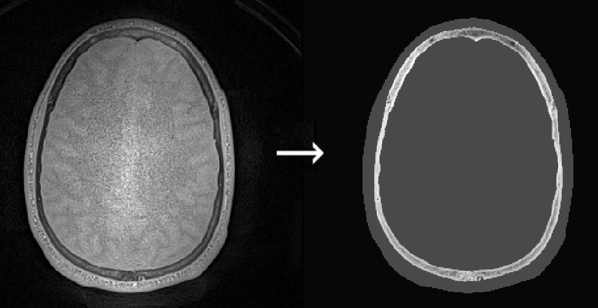
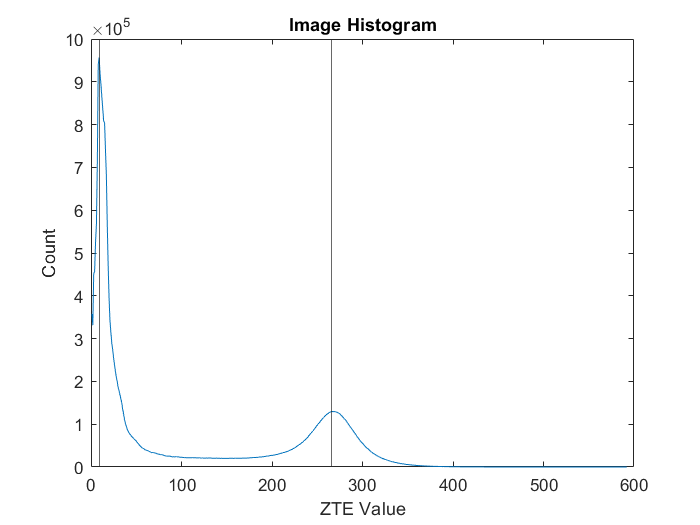
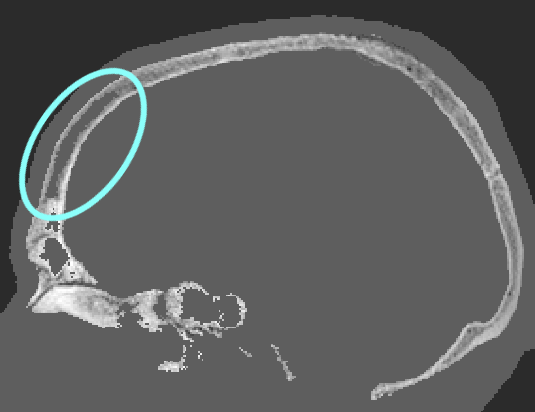

# PETRA-TO-CT

MATLAB toolbox for converting a Siemens PETRA image to a pseudo-CT.

:warning: *This repository is still under development. Breaking changes may occur!*

## Overview

Many therapeutic techniques, including transcranial ultrasound stimulation (TUS), require a structural computed tomography (CT) image of the head and skull for treatment planning. However, in a research setting, obtaining CT images can be problematic. This toolbox allows the conversion of a SIEMENS PETRA (pointwise encoding time reduction with radial acquisition) magnetic resonance (MR) image to a pseudo-CT image.



The conversion broadly follows the steps outlined in two papers by Florian Wiesinger *et al* (see [here](https://doi.org/10.1002/mrm.25545) and [here](https://doi.org/10.1002/mrm.27134)), but using a different conversion curve derived from paired PETRA and low-dose CT images taken on three subjects. The steps are as follows:

1. Debiasing the image using [N4ITK MRI bias correction](https://doi.org/10.1109/tmi.2010.2046908).
2. Applying histogram normalisation to shift the soft-tissue peak to 1.
3. Segmenting the skull and head in the image using SPM12, followed by morphological operations in MATLAB.
4. Applying a linear mapping to MR voxel values in the skull bone, and using fixed values elsewhere in the head.

The conversion in Step 4 relies on the pre-processing performed in Steps 1 and 2. These steps must always be applied in the same way for the conversion to work correctly.

## MR protocol

The conversion is derived from a pair-wise mapping between Siemens PETRA images and low-dose CT images. Thus, the PETRA images must always be acquired using the same sequence parameters. The scan parameters are available for download from the open-win platform. Some key parameters are given below.

General setup:

- System – Siemens Magnetom Prisma
- Coil – Head/Neck 64 or 32 Channel Head Coil
- Software Version – Syngo MR E11

Key sequence parameters:

- TR 1 – 3.61 ms
- TE – 0.07 ms
- Flip angle – 1 degree
- Slices per slab – 320

## Setup

To use the conversion toolbox, the following dependencies must first be installed:

- [3D Slicer ](https://www.slicer.org/)
- [SPM12](https://www.fil.ion.ucl.ac.uk/spm/)
- [Tools for NIfTI and ANALYZE image](https://uk.mathworks.com/matlabcentral/fileexchange/8797-tools-for-nifti-and-analyze-image) (can be installed from the MATLAB add-on explorer)

After installation, the following setup steps must be performed

- This toolbox, SPM12, and the NIFTI tools must be added to the MATLAB path.

- 3D Slicer must be added to the system path

  - Linux: 

    ````bash
    export PATH="/path/to/Slicer-X.Y.Z-linux-amd64:$PATH"
    ````

  - Windows: 

    1. Type `Environment Variables` in the search bar. This should open the `System Properties` dialog box.
    2. Click on `Environment Variables` 
    3. Under `System variables`, select `Path` and then `Edit`
    4. Select `New` and add the root folder and bin directory of Slicer to the path, e.g.,

        ```
        C:\Users\username\AppData\Local\NA-MIC\Slicer X.Y.Z
        C:\Users\username\AppData\Local\NA-MIC\Slicer X.Y.Z\bin
        ```
        
        (where `X.Y.Z` is the Slicer version number).
    


## Usage

Convert a PETRA image to a pseudo-CT:

```matlab
petraToCT.convert('myImage.nii');
```

Convert, keeping the SPM segmentation:

```matlab
petraToCT.convert('myImage.nii', DeleteSegmentation=false);
```

## k-Plan calibration file

To use the converted images with [k-Plan](https://k-plan.io), the images should be loaded using [this calibration file](docfiles/ct-calibration/ct-calibration-low-dose-30-March-2023-v1.h5). This was obtained using a CIRS Model 062M Electron Density Phantom using the same acquisition settings.

## Trouble shooting

### Histogram normalisation

The plot produced by the histogram normalisation should look like the figure below, with a vertical line through the right-most peak in the histogram. If the histogram peak is not correctly identified, adjust the input values for `HistogramMinPeakDistance` and `HistogramNPeaks` until the peak is correctly identified.



### Holes in the mask

If the converted pseudo-CT appears to have large regions of soft-tissue within the skull, try increasing the value of `SkullMaskSmoothing`, e.g., to 3 (from the default value of 1).



